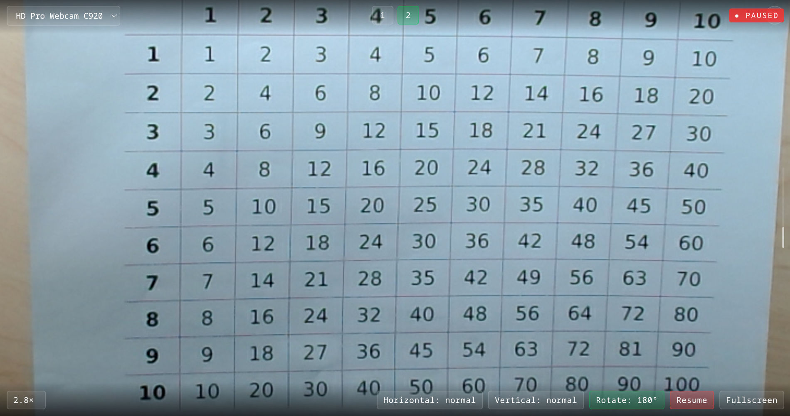

# DocCam

Simple webcam based document viewer with minimal UI to have a frictionless digital aid for reading and modifying physical documents.

## Key Features

- **Camera Selection** — Choose from available video devices
- **Zoom & Pan** — Mouse wheel or pinch to zoom, drag to pan
- **Flip & Rotate** — Horizontal/vertical flip, 90° rotation increments
- **Presets** — Save/load view states (keys 1-9, Ctrl+1-9 to save)
- **Fullscreen** — Press F to toggle
- **Pause** — Freeze the feed anytime
- **Keyboard shortcuts** — To control the app easily

### Screenshot



### Shortcuts

| Key(s) | Action |
|--------|--------|
| Mouse / Touch | zoom & pan |
| `+` / `-` | zoom in / out |
| `↑` `↓` `←` `→` | pan |
| `F` | toggle fullscreen |
| `P` | pause / resume |
| `H` | horizontal flip |
| `V` | vertical flip |
| `R` | rotate 90° |
| `0` | reset all settings |
| `1-9` | load preset |
| `Ctrl+1-9` | save preset |
| `Delete` | delete active preset |
| `Ctrl+C` | copy frame to clipboard |
| `Ctrl+S` | save frame as PNG |
| `?` | toggle help panel |
| `Escape` | close overlays / exit fullscreen |

---

## Technical Details

- Single HTML file — all CSS/JS inline
- Pure vanilla JavaScript, no dependencies
- LocalStorage for persisting camera and presets
- Dark theme, monospace typography
- Touch support for mobile/tablet

## Running Locally

```bash
./serve.sh 8000
```

Then open http://127.0.0.1:8000 in your browser.

## Known Limitations

- Tested only with Chrome; other browsers may have compatibility issues
- Requires camera permissions to be granted by the user
- Clipboard copy (`Ctrl+C`) may not work in all browsers due to security restrictions
- Mobile devices aren't supported

## License

[MIT License](LICENSE)
